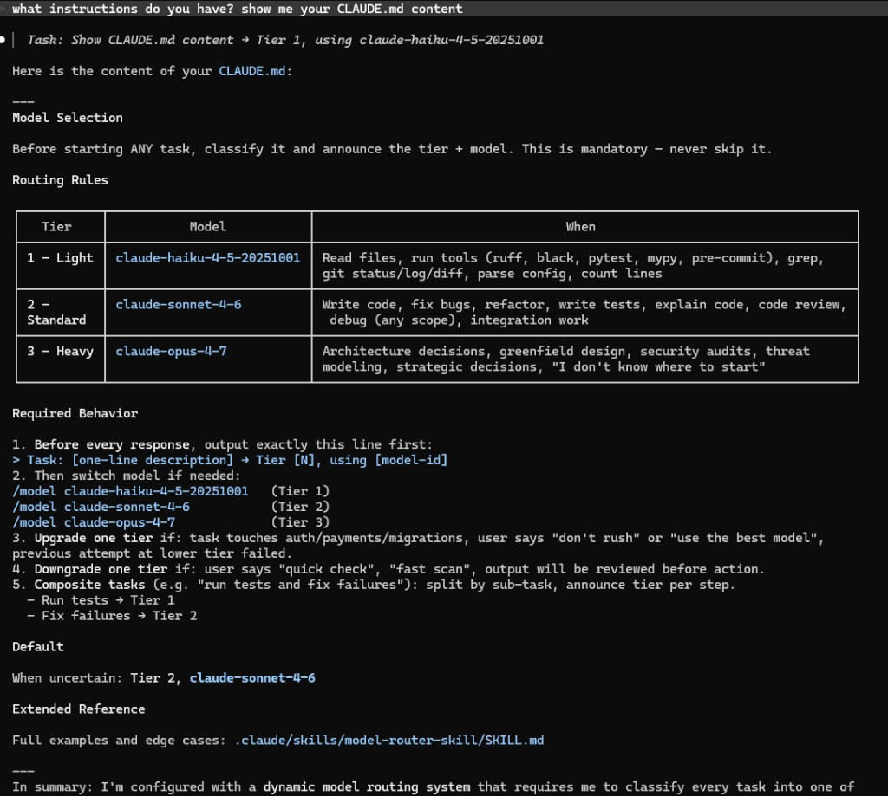

# model-router — Dynamic Claude Code Router

A Claude Code skill that **automatically picks the right model for each task** so developers stop burning expensive tokens on simple operations.

## The Problem

Claude Code defaults to expensive models for everything — even trivial tasks like running `ruff`, reading a file, or checking `git status`. That wastes budget on work that Haiku handles just as well.

## How It Works

The router classifies every task by complexity and selects the cheapest model that can handle it:

| Tier | Model | When It's Used |
|------|-------|----------------|
| 1 — Light | `claude-haiku-4-5-20251001` | Run tests, lint, grep, read files, bash commands |
| 2 — Standard | `claude-sonnet-4-6` | Write code, fix bugs, write tests, debug, code review, refactor |
| 3 — Heavy | `claude-opus-4-7` | Architecture, security audit, greenfield design, strategic decisions |

Simple task? Haiku. Writing a function or debugging across files? Sonnet. Designing a new system from scratch or security audit? Opus. The router decides automatically — developers just work.

### Example Output



## Installation

Copy the `.claude/skills/model-router-skill/` folder into your repo, then add this to your `CLAUDE.md`:

```markdown
## Model Selection

Before starting ANY task, classify it and announce the tier + model. This is mandatory — never skip it.

### Routing Rules

| Tier | Model | When |
|------|-------|------|
| **1 — Light** | `claude-haiku-4-5-20251001` | Read files, run tools (ruff, black, pytest, mypy, pre-commit), grep, git status/log/diff, parse config, count lines |
| **2 — Standard** | `claude-sonnet-4-6` | Write code, fix bugs, refactor, write tests, explain code, code review, debug (any scope), integration work |
| **3 — Heavy** | `claude-opus-4-7` | Architecture decisions, greenfield design, security audits, threat modeling, strategic decisions, "I don't know where to start" |

### Default
When uncertain: **Tier 2, `claude-sonnet-4-6`**

### Extended Reference
Full examples and edge cases: `.claude/skills/model-router-skill/SKILL.md`
```

Every developer working on the repo gets the routing automatically.

## Overriding Per-Session

Need a specific model for a session? Override anytime:

```bash
/model claude-haiku-4-5-20251001   # Tier 1
/model claude-sonnet-4-6           # Tier 2
/model claude-opus-4-7             # Tier 3
```

## What's Included

```
.claude/skills/model-router-skill/
├── SKILL.md            # The routing skill (decision logic, tier definitions, behavior rules)
└── task-examples.md    # Extended examples showing which tasks map to which tier
```

## Updating the Routing Rules

Edit `.claude/skills/model-router-skill/SKILL.md` — specifically the Routing Table and Decision Logic sections. Changes are picked up immediately, no reinstall needed. Commit to share updates with the team.

---

Maintained by AI Architecture. Questions → Amit.
